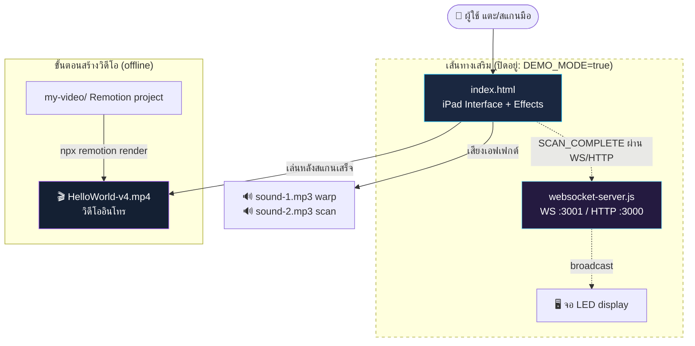
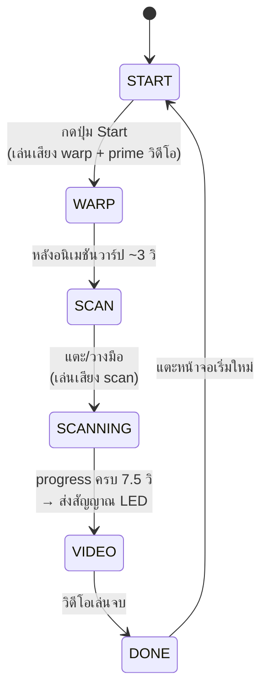

# 🚀 Galaxy Gate — เอกสารสรุประบบหลังบ้าน

> เอกสารนี้อธิบายว่า **โปรเจกต์นี้คืออะไร ทำงานยังไง และแต่ละส่วนเชื่อมโยงกันอย่างไร**
> เขียนให้คนที่เพิ่งเข้ามาดูโปรเจกต์อ่านแล้วเข้าใจภาพรวมได้เร็ว

---

## 1. ระบบนี้คืออะไร

**Galaxy Gate** คือประสบการณ์อินเทอร์แอกทีฟธีมอวกาศสำหรับ **พิธีเปิดงานสัปดาห์วิทยาศาสตร์**

ผู้ใช้ (เช่น ผู้อำนวยการ) เดินมาที่หน้าจอ → กดปุ่ม **Start** → **วางมือสแกน** → ระบบเล่น **อนิเมชันวาร์ป + สแกน** แล้วจบด้วย **วิดีโออินโทรอวกาศ** → กลับสู่หน้าต้อนรับเพื่อเริ่มรอบใหม่

ทั้งหมดรันในเบราว์เซอร์ ปัจจุบัน deploy อยู่บน GitHub Pages: `https://kagenokami9.github.io/ssr/`

---

## 2. ผังภาพรวมสถาปัตยกรรม

หัวใจของระบบตอนนี้คือ **`index.html` ไฟล์เดียว** ที่ทำงานครบจบในตัว (สแกน + เล่นวิดีโอ)
ส่วน **server + จอ LED** เป็นเส้นทาง "เสริม" สำหรับงานจริง ซึ่งตอนนี้ **ปิดอยู่** (`DEMO_MODE = true`)



แบบ ASCII (เผื่อ editor ที่ไม่ render Mermaid):

```
                        ┌──────────────────────────────┐
   👤 ผู้ใช้ ──แตะ/สแกน──►│        index.html            │
                        │  (iPad interface + canvas FX)│
                        └───────────┬──────────────────┘
                                    │ สแกนเสร็จ
                 ┌──────────────────┼───────────────────┐
                 ▼                  ▼                   ▼
        🔊 sound-1/2.mp3   🎬 HelloWorld-v4.mp4   (เส้นทางเสริม—ปิดอยู่)
          (เอฟเฟกต์เสียง)     (วิดีโออินโทร)              │ SCAN_COMPLETE
                                    ▲                     ▼
                                    │           websocket-server.js
                          สร้างจาก  │            (WS :3001 / HTTP :3000)
                                    │                     │ broadcast
                          my-video/ (Remotion)            ▼
                          └── npx remotion render      🖥️ จอ LED
```

---

## 3. องค์ประกอบแต่ละไฟล์

| ไฟล์ / โฟลเดอร์ | หน้าที่ | เชื่อมกับอะไร |
|---|---|---|
| `index.html` | **หน้าเว็บหลัก** — state machine 6 สถานะ + เอฟเฟกต์ canvas + เล่นเสียง + เล่นวิดีโออินโทร | เรียก `HelloWorld-v4.mp4`, `sound-1/2.mp3`; (เสริม) ยิงสัญญาณไป `websocket-server.js` |
| `HelloWorld-v4.mp4` | **วิดีโออินโทร** ที่เล่นหลังสแกนเสร็จ (23.5 วิ, มีเสียง) | ถูกอ้างใน `index.html` (`CONFIG.INTRO_VIDEO_URL`) |
| `HelloWorld-v3.mp4` | วิดีโออินโทร **เวอร์ชันเก่า** (36.5 วิ) — เก็บไว้เฉย ๆ ไม่ได้ใช้แล้ว | — |
| `my-video/` | **โปรเจกต์ Remotion** (React) ที่ใช้สร้าง/เรนเดอร์วิดีโออินโทร | เรนเดอร์ออกมาเป็น `HelloWorld-v4.mp4` |
| `websocket-server.js` | **Bridge server** รับสัญญาณ `SCAN_COMPLETE` จากหน้าเว็บ → กระจายไปจอ LED | รับจาก `index.html`, ส่งต่อไป LED display |
| `sound-1.mp3` | เสียงตอนกด Start / วาร์ป (Screen 2) | `index.html` (`CONFIG.WARP_AUDIO_URL`) |
| `sound-2.mp3` | เสียงตอนสแกนมือ (Screen 4) | `index.html` (`CONFIG.SCAN_AUDIO_URL`) |
| `my-video/public/ggd.mp3` | **เพลงประกอบ** ที่ฝังอยู่ในวิดีโออินโทร | ใช้ตอนเรนเดอร์ใน Remotion |
| `README.md` | คู่มือ setup **เวอร์ชันเก่า** (ดูหมายเหตุข้อ 8) | — |

---

## 4. Flow การทำงาน (State Machine ใน `index.html`)

หน้าเว็บทำงานเป็นเครื่องสถานะ 6 สถานะ (นิยามที่ `index.html:1095`):



แบบ ASCII พร้อมสิ่งที่เกิดในแต่ละช่วง:

```
 [START]  หน้าปุ่ม Start
    │  กดปุ่ม → playSound(warp) + primeMedia(video)   (ต้องอยู่ใน user gesture)
    ▼
 [WARP]   อนิเมชันวาร์ปดาว ~3 วิ  (runWarp)
    ▼
 [SCAN]   หน้า "วางมือบนหน้าจอ" + พื้นหลัง nebula  (รอสัมผัส)
    │  แตะ → playSound(scan)
    ▼
 [SCANNING]  แถบ progress 0→100% ใน 7.5 วิ + particle/ripple  (SCAN_DURATION)
    │  ครบ → sendLEDSignal()  (เสริม: ยิงไป server; DEMO_MODE = แค่ log)
    ▼
 [VIDEO]  เล่น HelloWorld-v4.mp4  (playIntroVideo)
    │  จบ/หมดเวลา → finishIntroVideo()
    ▼
 [DONE]   หน้าต้อนรับ "ยินดีต้อนรับสู่งานสัปดาห์วิทยาศาสตร์"
    │  แตะ → กลับ START
    └────────────────────────────────► (วนรอบใหม่)
```

**จุดเทคนิคที่ควรรู้:**
- เสียงและวิดีโอถูกสั่งเล่น**ภายใน user gesture** (ตอนกด Start / ตอนแตะสแกน) เพราะ iOS/มือถือบล็อกการเล่นสื่ออัตโนมัติ — โค้ดใช้ `primeMedia()` "ปลดล็อก" วิดีโอแบบ muted ไว้ก่อน แล้วค่อยเปิดเสียงตอนเล่นจริง
- วิดีโออินโทรถูก **preload ตั้งแต่เปิดหน้า** (`preloadIntroVideo()` ที่ท้ายไฟล์) เพื่อไม่ให้จอดำ/ดีเลย์ตอนสแกนเสร็จ

---

## 5. การเชื่อม iPad ↔ Server ↔ LED (เส้นทางเสริม)

ออกแบบไว้ให้ **หน้าเว็บบน iPad** ยิงสัญญาณไป **server** เมื่อสแกนเสร็จ แล้ว server กระจายต่อไป **จอ LED** ให้เล่นเอฟเฟกต์พร้อมกัน

```
 index.html ──SCAN_COMPLETE──►  websocket-server.js  ──broadcast──►  จอ LED (หลายจอได้)
   (iPad)      WS :3001 หรือ         (bridge)                         (led display)
               HTTP :3000 fallback
```

**ช่องทางส่งสัญญาณ** (`sendLEDSignal()` ที่ `index.html:1574`):
1. **WebSocket** (`ws://<server>:3001`) — ช่องทางหลัก
2. **HTTP fallback** (`POST http://<server>:3000/api/trigger`) — ใช้เมื่อ WS ต่อไม่ได้

**ชนิดข้อความ (WebSocket) ที่ server รองรับ** (`websocket-server.js`):

| ทิศทาง | type | ความหมาย |
|---|---|---|
| Client → Server | `REGISTER` | บอก role ว่าเป็น `ipad` หรือ `led_display` |
| iPad → Server | `SCAN_COMPLETE` | ทริกเกอร์หลัก — server จะ broadcast ต่อไป LED ทุกจอ |
| Server → LED | `SCAN_COMPLETE` | สัญญาณให้จอ LED เล่นเอฟเฟกต์ |
| Any → Server | `PING` / `PONG` | เช็คการเชื่อมต่อ |

**HTTP endpoints:** `GET /health` (สถานะ server), `POST /api/trigger` (ยิงเอฟเฟกต์แบบ fallback)

> ⚠️ **ปัจจุบันเส้นทางนี้ปิดอยู่** เพราะ `index.html` ตั้ง `DEMO_MODE = true` → `sendLEDSignal()` แค่ log ไม่ได้ยิง network จริง (ดูข้อ 7–8)

---

## 6. Pipeline วิดีโออินโทร (จาก Remotion → ไฟล์ mp4)

วิดีโอ `HelloWorld-v4.mp4` **ไม่ได้ถ่ายจากกล้อง** แต่ **สร้างด้วยโค้ด** ในโปรเจกต์ Remotion (`my-video/`) แล้วเรนเดอร์ออกมาเป็นไฟล์

```
my-video/  (React + Remotion)
   src/MainComposition.tsx   ← ประกอบ 8 ฉากต่อกันด้วย fade transition
   src/scenes/*.tsx          ← แต่ละฉาก (หุ่นยนต์อินโทร, นักบินอวกาศ 3 ช็อต, เคมี, ชีวะ ...)
   src/components/RobotKit.tsx  ← ชิ้นส่วน SVG/utility ที่ทุกฉากใช้ร่วม
         │
         │  npx remotion render MainComposition ../HelloWorld-v4.mp4
         ▼
   HelloWorld-v4.mp4  ──►  index.html เอาไปเล่นเป็นวิดีโออินโทร
```

- คอมโพสิชันหลักชื่อ **`MainComposition`** ขนาด 1920×1080, 60fps, ยาว ~23.5 วิ
- มีเพลงประกอบ `ggd.mp3` ฝังในวิดีโอ (เรนเดอร์รวมเสียงมาให้เลย)
- คำสั่งพัฒนา/สร้าง (รันในโฟลเดอร์ `my-video/`): `npm run dev` (เปิด Remotion Studio ดูตัวอย่าง), `npm run lint` (เช็คโค้ด)

---

## 7. ค่า Config สำคัญ

**ใน `index.html` (`CONFIG` บรรทัด ~1080):**

| คีย์ | ค่า (ปัจจุบัน) | ความหมาย |
|---|---|---|
| `WS_URL` | `ws://192.168.1.100:3001` | ที่อยู่ WebSocket server (แก้เป็น IP จริงในงาน) |
| `LED_API_URL` | `http://192.168.1.100:3000/api/trigger` | HTTP fallback |
| `USE_WEBSOCKET` | `true` | เลือกใช้ WS (`false` = ใช้ HTTP อย่างเดียว) |
| `SCAN_DURATION` | `7500` | เวลาแถบสแกน (มิลลิวินาที) |
| `INTRO_VIDEO_URL` | `HelloWorld-v4.mp4` | ไฟล์วิดีโออินโทรที่เล่นหลังสแกน |
| `WARP_AUDIO_URL` | `sound-1.mp3` | เสียงตอนวาร์ป |
| `SCAN_AUDIO_URL` | `sound-2.mp3` | เสียงตอนสแกน |
| `DEMO_MODE` | `true` | **`true` = ไม่ยิง network จริง** (แค่จำลอง) — ตั้ง `false` เมื่อใช้กับ server/LED จริง |

**ใน `websocket-server.js` (`CONFIG`):** `WS_PORT: 3001`, `HTTP_PORT: 3000`, `CORS_ORIGIN: '*'`

---

## 8. สถานะปัจจุบัน / หมายเหตุสำคัญ

- ✅ **`index.html` ทำงานแบบ standalone ได้เลย** (สแกน → เล่นวิดีโอ → วนรอบ) ไม่จำเป็นต้องมี server ก็เล่นได้ เพราะ `DEMO_MODE = true`
- ⚠️ **`README.md` เดิมล้าสมัย** — อ้างถึงไฟล์ `ipad-interface.html` และ `led-display.html` ซึ่ง **ถูกลบ/รวมเข้า `index.html` ไปแล้ว** ปัจจุบันมีแค่ `index.html` ไฟล์เดียว
- 🔌 **ถ้าจะใช้จอ LED จริง:** ต้องตั้ง `DEMO_MODE = false`, แก้ `WS_URL`/`LED_API_URL` เป็น IP ของเครื่อง server, รัน `websocket-server.js`, และมีหน้าจอ LED ที่ลงทะเบียน role `led_display` ไว้ (ปัจจุบันยังไม่มีไฟล์หน้า LED ในโฟลเดอร์นี้)
- 🎬 **ไฟล์วิดีโอ:** ใช้ `HelloWorld-v4.mp4` (ใหม่) — `HelloWorld-v3.mp4` เป็นของเก่าที่เก็บไว้เฉย ๆ

---

## 9. วิธีรัน / แก้แต่ละส่วน (สำหรับ dev)

```bash
# ── เปิดหน้าเว็บหลัก (ทดสอบบนคอม) ──
# วิธีง่ายสุด: เปิด index.html ด้วยเบราว์เซอร์ตรง ๆ
# หรือ serve ผ่าน local server (แนะนำ เพราะวิดีโอ/เสียงโหลดได้ชัวร์กว่า)
npx http-server . -p 8080      # แล้วเปิด http://localhost:8080/

# ── รัน WebSocket server (เฉพาะเมื่อใช้จอ LED จริง) ──
npm install ws
node websocket-server.js       # WS :3001, HTTP :3000

# ── แก้ไข/สร้างวิดีโออินโทร (Remotion) ──
cd my-video
npm install
npm run dev                    # เปิด Remotion Studio ดูตัวอย่าง/แก้ฉาก
npx remotion render MainComposition ../HelloWorld-v4.mp4   # เรนเดอร์วิดีโอใหม่
```

---

> 📎 **สรุปสั้น:** ผู้ใช้แตะที่ `index.html` → สแกน → เล่น `HelloWorld-v4.mp4` (สร้างจาก Remotion ใน `my-video/`) → วนรอบใหม่
> ส่วน `websocket-server.js` + จอ LED เป็นระบบเสริมสำหรับงานจริงที่ตอนนี้ยังปิด (`DEMO_MODE=true`)
